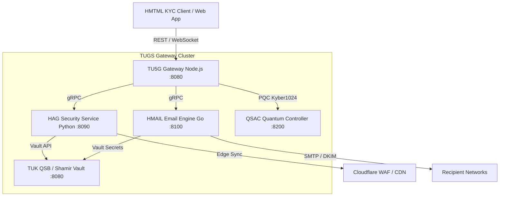

# TUGS — TU5G Gateway System


**TUGS (TU5G Gateway System)** is an enterprise-grade, post-quantum-ready sovereign identity, KYC verification, and security orchestration platform built for high-scale microservices. Integrated with the **BASE44** ecosystem, TUGS combines real-time WebSocket communication, gRPC inter-service networking, post-quantum cryptographic encapsulation, and adaptive rate-limiting.

---

## 🚀 Activated Protocols & Badges

- **TUGS ACTIVATED** — Sovereign Gateway Engine v1.0
- **HMTML ACTIVATED** — Hyper-Media Telemetry & Markup Layer for Responsive KYC
- **HPLS AI ACTIVATED** — High-Performance Predictive Logic Service
- **HAABS ACTIVATED** — Hyper-Agile Adaptive Security Architecture
- **AM=YOU PROTOCOL** — Decentralized Identity & Biometric Verification Model
- **TU5G PARTNER WITH BASE44** — Native integration with Base44 Platform & Workspace

---

## 🏛️ System Microservices

TUGS comprises five core microservices operating in containerized orchestration:

1. **TU5G Gateway (`/tu5g`)**
   - **Runtime:** Node.js 20 / TypeScript / Express / `ws`
   - **Role:** Primary REST, WebSocket, and gRPC ingress gateway. Handles phone OTP dispatch (`/api/v1/otp/request`), code verification (`/api/v1/otp/verify`), real-time socket events, and KYC document report submission (`/api/v1/report`).

2. **HAG — Hyper-Agile Gateway (`/hag`)**
   - **Runtime:** Python 3.11 / FastAPI / gRPC
   - **Role:** Adaptive threat protection, Cloudflare edge dynamic rule enforcement, RSA/JWT token signing, and real-time security policy evaluation under HAABS.

3. **HMAIL — Hyper Mail Service (`/hmail`)**
   - **Runtime:** Go 1.22
   - **Role:** High-throughput transactional email delivery engine with DKIM signature verification, SMTP pooling, and automated OTP delivery backups.

4. **QSAC — Quantum-Safe Access Controller (`/qsac`)**
   - **Runtime:** C++ / Rust / Containerized Service
   - **Role:** Post-quantum cryptography (PQC) controller leveraging **Kyber1024** key encapsulation (KEM) to safeguard session tokens against quantum decryption threats.

5. **TUK QSB / Vault (`/vault`)**
   - **Runtime:** Go / Docker
   - **Role:** TUK Quantum Service Bus state store utilizing **Shamir's Secret Sharing Scheme (3-of-5 threshold)** for zero-trust key management and root CA certificate distribution.

---

## 📐 Architecture & Flow Diagram



### ASCII Architecture View

```
  +-------------------------------------------------------------+
  |              HMTML KYC Single Page Frontend                 |
  |     (Phone -> OTP Request -> OTP Verify -> Upload -> Report) |
  +------------------------------+------------------------------+
                                 |
                          HTTP / WebSockets
                                 v
  +-------------------------------------------------------------+
  |                     TU5G REST & WS Gateway                  |
  |                         (Port :8080)                        |
  +--------+---------------------+--------------------+---------+
           |                     |                    |
       gRPC|                 gRPC|          Kyber1024|
           v                     v                    v
    +--------------+      +--------------+     +--------------+
    |  HAG Engine  |      | HMAIL Service|     | QSAC PQC KEM |
    | (Python 8090)|      |  (Go 8100)   |     | (Port :8200) |
    +-------+------+      +------+-------+     +--------------+
            |                    |
            +----------+---------+
                       v
            +--------------------+
            | TUK QSB Vault      |
            | (Shamir 3-of-5)    |
            +--------------------+
```

---

## ⚡ Quick-Start Guide

### Prerequisites
- Docker Engine 24.0+ & Docker Compose v2.20+
- Git

### 1. Clone Repository & Setup Secrets
```bash
git clone https://github.com/tu5g-online/tugs-gateway.git /app/tugs-gateway
cd /app/tugs-gateway

# Copy example environment file
cp .env.example .env
```

### 2. Launch Stack via Docker Compose
```bash
docker compose up -d --build
```

### 3. Verify Health Status
```bash
curl http://localhost:8080/api/v1/health
```

Expected Response:
```json
{
  "status": "OK",
  "service": "TU5G Gateway",
  "version": "1.0.0",
  "services": {
    "hag": "UP",
    "hmail": "UP",
    "qsac": "UP",
    "vault": "UP"
  }
}
```

---

## 📖 API Reference & HMTML Client

- **OpenAPI 3.0 Spec:** Located at [`openapi/tugs-openapi.yaml`](openapi/tugs-openapi.yaml). Viewable via Swagger UI or Redoc.
- **HMTML KYC Application:** Located at [`hmtml/hmtml_kyc.html`](hmtml/hmtml_kyc.html).

### Endpoint Overview

| Method | Endpoint | Description | Auth Required |
| :--- | :--- | :--- | :--- |
| `POST` | `/api/v1/otp/request` | Dispatch OTP to phone (`+984799...`) | No |
| `POST` | `/api/v1/otp/verify` | Verify 6-digit OTP code & issue token | No |
| `POST` | `/api/v1/report` | Submit multipart KYC report with doc file | Bearer JWT |
| `GET` | `/api/v1/health` | Gateway health check & microservice status | No |

---

## 🛂 KYC Verification Workflow

1. **Step 1 — Subscriber Phone Input:** Client inputs subscriber phone number formatted as `+984799...`.
2. **Step 2 — OTP Request (`POST /api/v1/otp/request`):** Gateway issues a session token and dispatches verification code via SMS/HMAIL channel.
3. **Step 3 — Verification (`POST /api/v1/otp/verify`):** Client submits OTP code and session token. On verification success, an authenticated session token is granted.
4. **Step 4 — Document Attachment:** User attaches government ID (passport, national ID, or driver's license).
5. **Step 5 — Report Generation (`POST /api/v1/report`):** Multipart submission sends file and verification payload for automated AI verification and archiving. Real-time updates are streamed via WebSocket.

---

## 🛡️ Security Hardening Checklist (HAABS)

- [x] **Post-Quantum Encryption:** Kyber1024 key encapsulation enabled on QSAC.
- [x] **Shamir's Secret Sharing:** Key state split across 5 shares with 3-share recovery threshold in TUK QSB Vault.
- [x] **Strict Rate Limiting:** `express-rate-limit` enforcement on OTP endpoints returning HTTP 429 on abuse.
- [x] **Header Security & CORS:** Strict origin policies and sanitization on all HTTP routes.
- [x] **gRPC Mutual TLS:** TLS 1.3 mutual certificate authentication between internal microservices.

---

## 🔄 CI/CD Pipeline

The GitHub Actions workflow in [`.github/workflows/ci-cd.yml`](.github/workflows/ci-cd.yml) automates build, test, and delivery:

1. **`test-tu5g`:** Node.js 20 runner, executes Jest test suite with 90%+ line/branch coverage check.
2. **`test-hag`:** Python 3.11 runner, executes `pytest` with `pytest-cov` enforcement.
3. **`test-hmail`:** Go 1.22 runner, validates Go module tests and coverage metrics.
4. **`security-scan`:** Snyk vulnerability scanner checking for dependency CVEs.
5. **`build`:** On merge to `main`, Docker Buildx compiles multi-stage containers and pushes tagged images to GitHub Container Registry (`ghcr.io`).

---

## 👨‍💻 Author & Support

- **Author:** Timothy Abraham (T-Driven)
- **Project:** Clean World Project — CGT
- **License:** [MIT License](LICENSE)
- **Support Email:** [support@tu5g.online](mailto:support@tu5g.online)
- **Official Website:** [www.tu5g.online](https://www.tu5g.online)
- **Ecosystem Partner:** **BASE44 Platform**
